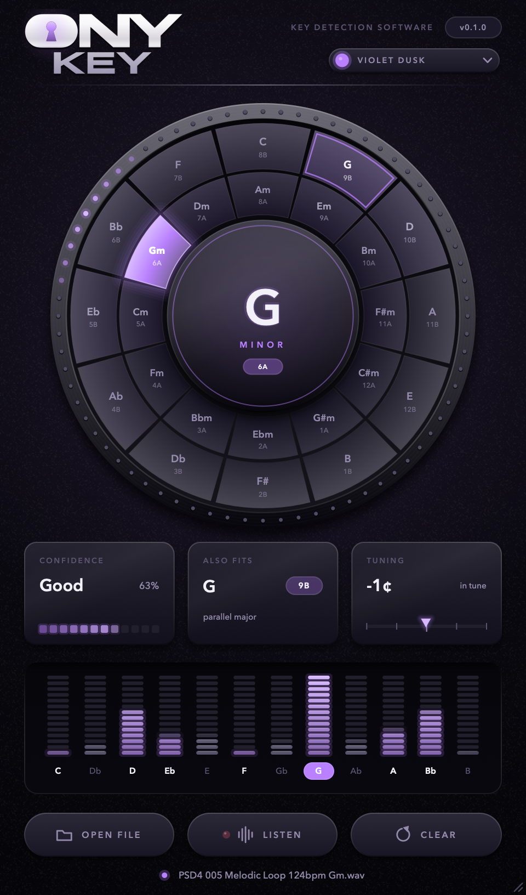
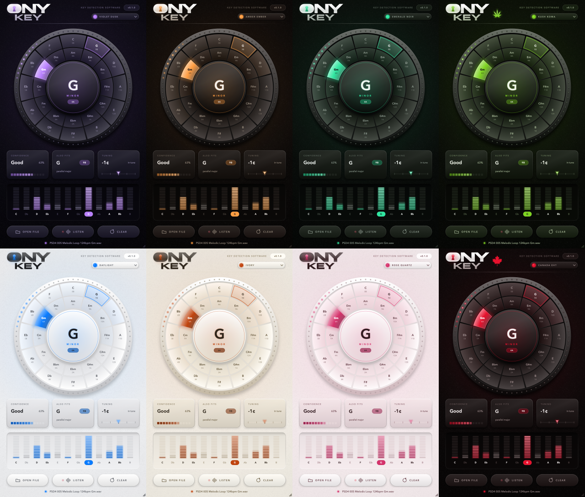

# ONY Key

A simple key-detection plugin by **ONYVA**. Drop a sample on it and it tells
you the key, its Camelot code, and how sure it is. Built on JUCE (CMake),
targeting VST3, AU, AAX (SDK-gated), and Standalone. Sister plugin to ONY Verb.

<p align="center">
  
</p>

<p align="center">
  
</p>

## Using it

- **Drop a file** (WAV, AIFF, FLAC, OGG, MP3; plus M4A/CAF on macOS) anywhere
  on the window, or use **OPEN FILE**. The whole file is analysed in the
  background, usually in well under a second.
- **LISTEN** analyses whatever plays through the track the plugin is on.
  Put ONY Key on a track, press LISTEN, play the clip, press STOP. In the
  Standalone app it listens to the audio input instead.
- Audio passes through untouched. The last result is saved with your
  session.

What you see:

| | |
|---|---|
| Centre | The key (e.g. **G minor**) and its Camelot code (**6A**) |
| Wheel | Circle of fifths in Camelot layout (majors outside, relative minors inside). The detected key is lit, the runner-up is outlined, and every key is tinted by how well it matched. Neighbouring segments are the harmonically compatible keys |
| Confidence | High / Good / Fair / Low, calibrated against real loops (see below) |
| Also fits | Runner-up key, often the relative or parallel key |
| Tuning | How far the sample sits from A440, in cents |
| Bars | How much of each note was heard, spelled for the key (Bb in G minor, A# in F# minor). Notes in the detected scale are lit and the tonic is marked |

- **Hover** any key on the wheel to outline the keys it mixes with (Camelot
  neighbours); the status line lists them.
- **Click the centre** to copy the result ("G minor (6A)") to the clipboard.
- **Themes**: the pill under the version number opens the same 18 theme
  palettes as ONY Verb (dark and light). They tint the whole instrument:
  bezel metal, glass, LEDs, the keyhole light and the logo. Kush Koma and
  Canada Eh? add their emblems beside the logo, and Acid Trip cycles the
  accent through the rainbow. "Hide NSFW themes" is at the bottom of the
  menu. The choice is a per-user preference (`~/Library/Application
  Support/ONYVA/ONY Key/theme.txt`), shared by every instance, like ONY
  Verb's.
- **Particles** (ONY Verb's particle system): glowing particles drift out of
  the wheel's centre with the input while LISTENing, burst on transients and
  when a key is found, and pop on button clicks. Themed as in Verb: Kush Koma
  turns them into leaves and adds rising smoke plus a slowly building room
  haze, Canada Eh? sends beavers, and Acid Trip shifts their hue and adds a
  rotating, breathing spiral over the window.
- **Resize** from the bottom-right corner (70-160%); the size is saved with
  the session.

**One-shots.** A single note (an 808, a bass hit, a drone) has no third,
so major and minor can't be told apart. ONY Key shows it as **root note**
(e.g. "C · root note") and gives a best-guess key in a smaller panel.

## How it works

`Source/DSP/KeyDetector.h`. Short version:

1. Low-pass and resample to 11025 Hz.
2. 8192-point Blackman-Harris FFT every 2048 samples (~1.35 Hz resolution,
   enough to separate notes down to E1).
3. Pick spectral peaks that stand at least 6 dB clear of their surroundings,
   so drums, hats and noise mostly don't register.
4. Drop non-octave overtones (3rd, 5th, 6th, 7th harmonic) of a louder lower
   peak. The 5th harmonic of a bass note lands on its *major* third, which
   is the main reason naive detectors call minor loops major.
5. Fold the remaining peaks into a 10-cent pitch-class histogram. Estimate
   the tuning offset and remove it, so detuned samples still map to the
   right notes.
6. Correlate the 12-note profile against all 24 keys (Sha'ath profiles), add
   a bonus for keys whose tonic is the main bass note, and add a small prior
   towards minor.

### Accuracy

Measured with `ONYKeyEval` on 1,580 loops from commercial sample packs
whose filenames state the key:

| | |
|---|---|
| Exact key | 47.9% |
| MIREX score (partial credit for fifth / relative / parallel) | 58.5% |
| Major-labelled loops | 75.3% exact |
| Minor-labelled loops | 45.0% exact |

| Confidence shown | Right this often |
|---|---|
| High (80%+) | 88% |
| Good (60-80%) | 70% |
| Fair (40-60%) | 44% |
| Low | 12-30% |

Most misses are closely related keys, in this order: relative major (C minor
→ E♭ major), parallel major, a fifth away, or the major key a whole step down
(a Dorian loop labelled minor). Pack labels are themselves noisy here: a
house kit labelled "G min" often has a Dorian chord loop, or an FX/foley
sample that isn't really in any key. Keep this in mind before tuning the
detector further.

## Project layout

```
Source/
  PluginProcessor.{h,cpp}   Pass-through processor: file/listen actions, state save/restore
  PluginEditor.{h,cpp}      Editor: drag-and-drop, buttons, stats, status line
  AnalysisThreads.h         LiveAnalyser (lock-free FIFO from the audio thread -> worker)
                            and FileAnalyserThread (cancellable background file analysis)
  FileAnalyser.h            Decode a file to mono and run it through the detector
  Version.h                 Version string shown in the header
  DSP/
    KeyDetector.h           The detector (juce_core/juce_dsp only, no plugin/GUI deps)
    KeyNames.h              Key names, Camelot codes, relative keys
  UI/
    KeyWheel.h              Camelot wheel: machined bezel + dotted track, glass centre
                            disc, animated highlight, hover-to-mix, click-to-copy
    StatCards.h             Confidence (LED meter), Also fits, Tuning (needle strip)
    ChromaBars.h            12 segmented LED columns in a recessed well
    IconButton.h            Raised buttons with drawn icons; LISTEN has a level-reactive LED
    ThemePicker.h           Header pill + theme menu with swatches and "Hide NSFW themes"
    ParticleOverlay.h       ONY Verb's particle overlay (glows / leaves + smoke + haze /
                            beavers / acid spiral), dirty-rect repaints
    Shapes.h                Verb's leaf and beaver paths
    Wordmark.h              ONY KEY logo: mask filled with brushed metal, keyhole lit as a
                            status light (ember idle / violet found / pulse analysing / red listening)
    OnyvaLookAndFeel.h      Tooltips, popups, resize grip
    Animation.h             Frame-rate-independent easing
    Theme.h                 ONY Verb's 18 theme palettes, plus the hardware tones derived
                            from each (bezel, glass, LEDs, logo metal), persistence, Avenir Next
                            type, shared depth cues (raised/recessed/sheen/glow/grain),
                            vector flat/sharp signs
Tests/
  KeyTests.cpp              Unit tests (JUCE UnitTest): all 24 keys, detuning, 96 kHz,
                            one-shots, silence, NaN input, naming/Camelot
  KeyEval.cpp               Accuracy tool against key-labelled sample folders
  Snapshot.cpp              Renders the editor to PNG without a host: --theme, --listen
                            (runs processBlock), --drop, --watch (catches the result
                            burst), --idle <s> (slow theme effects)
Resources/
  ONYKey_LogoMask.png       Logo wordmark mask (white + alpha), compiled in as BinaryData
  ONYKey_KeyholeMask.png    The keyhole on its own, for the glow
  CanadaMapleLeaf.png       Canada Eh? emblem (shared with ONY Verb)
  brand/                    Source logo artwork
scripts/
  make_logo_assets.py       Regenerates the two masks from the source logo (sips + numpy)
  sign_and_notarize_macos.sh  Codesign + notarize the macOS bundles
  sign_windows.ps1            Codesign the Windows VST3
modules/JUCE                JUCE 9.0.2, pinned git submodule
```

## Building (macOS)

Requires Xcode command-line tools and CMake 3.22+.

```bash
git submodule update --init --recursive
cmake -S . -B build -G "Unix Makefiles" -DCMAKE_BUILD_TYPE=Release
cmake --build build --target ONYKey_VST3 --target ONYKey_AU --target ONYKey_Standalone -j 8
```

The build produces universal (Intel + Apple Silicon) binaries. The VST3 and
AU are copied to `~/Library/Audio/Plug-Ins` after building.

Configuring also applies a two-line fix to JUCE 9.0.2's
`juce_CoreMidi_mac.mm`, which doesn't compile against current Apple libc++
(the same fix ONY Verb carries by hand). It's a no-op once applied.

Tests and tools:

```bash
cmake --build build --target ONYKeyTests ONYKeyEval ONYKeySnapshot -j 8
./build/Tests/ONYKeyTests_artefacts/Release/ONYKeyTests
./build/Tests/ONYKeyEval_artefacts/Release/ONYKeyEval --verbose ~/path/to/labelled/loops
./build/Tests/ONYKeySnapshot_artefacts/Release/ONYKeySnapshot out/ some-loop.wav --listen another-loop.wav
```

Signing and notarizing work the same way as ONY Verb:

```bash
ONYVA_SIGNING_IDENTITY="Developer ID Application: ONYVA (TEAMID)" \
ONYVA_NOTARY_PROFILE="ONYVA-notary" \
./scripts/sign_and_notarize_macos.sh build
```

## Building (Windows, x64)

```powershell
git submodule update --init --recursive
cmake -S . -B build -G "Visual Studio 17 2022" -A x64
cmake --build build --config Release --target ONYKey_VST3 --target ONYKey_Standalone
```

Or run the **Windows Build** GitHub Action (`.github/workflows/build-windows.yml`),
which builds, runs the unit tests, and can attach the zips to a release.

## AAX

As with ONY Verb, pass `-DAAX_SDK_PATH=/path/to/AAX_SDK` to add the AAX target.

## Plugin metadata

| | |
|---|---|
| Manufacturer | ONYVA (`Onyv`) |
| Plugin name | ONY Key (`Onky`) |
| Category | Fx / Analyzer |
| Bundle ID | `com.onyva.onykey` |
